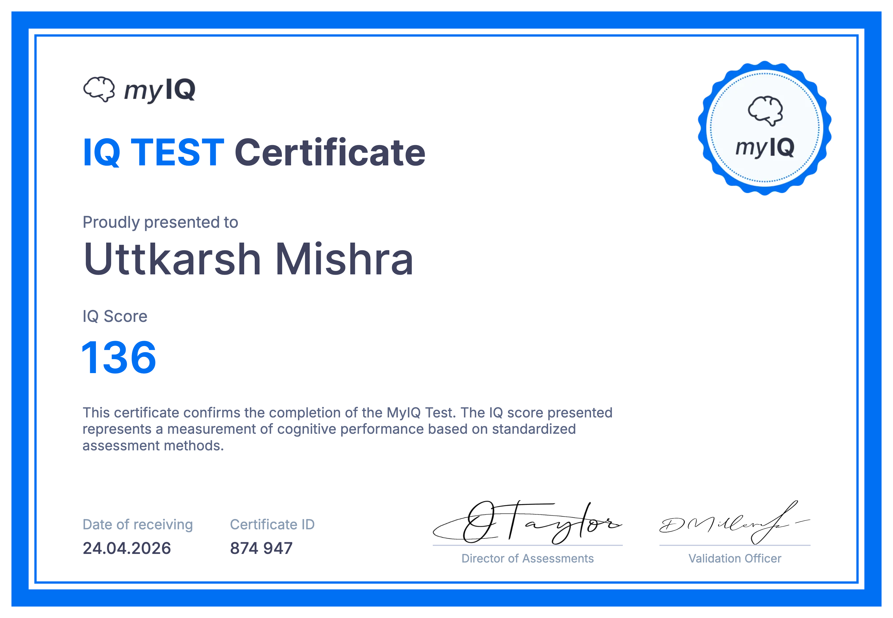

<div align="center">


<a href="https://wakatime.com/@1b2b3195-2f68-41bb-bf2a-c5cf4bd6838f">
  
</a>
&nbsp;


<br/><br/>

<a href="https://git.io/typing-svg">
  
</a>

<br/><br/>

[](https://www.linkedin.com/in/uttkarshmishra)
[](https://www.kaggle.com/uttu001)
[](https://www.instagram.com/being_uttu/)
[](https://www.facebook.com/uttu.01)
[](mailto:uttkarsh.mishra.um@gmail.com)

</div>

---

## 👨‍💻 About Me

> *"The best model is the one that runs — and improves — itself."*

I'm a **Senior Data Scientist** based in **Gurgaon, India**, with **7 years of experience** building production ML systems in **Fintech**. I specialise in credit risk intelligence, bureau-based modelling, alternate data, and increasingly, **GenAI-powered financial applications**.

My work spans the full credit lifecycle — from raw bureau ingestion to automated underwriting decisions — across personal loans, business loans, credit cards, BNPL, LAP, and two-wheeler finance. I've worked with every layer of Indian lending data: CIBIL tradelines, DPD buckets, enquiry patterns, device signals, bank statement cash flows, and GST intelligence.

What sets me apart: I don't just build models. I build **end-to-end decision pipelines** — config-driven, confidence-tiered, production-hardened from day one. I've interviewed **200+ candidates** for data roles, managed analytics teams of 4–5, and am now building my own fintech product on the side.

**I build end-to-end. I ship. I keep it running.**

---

## 🏦 Current Role — Indifi Technologies *(Jul 2024 – Present)*

Indifi is a fintech lender focused on SME and business loans. I work on the analytics and model development team, building systems that feed directly into automated underwriting.

---

### 📊 Bureau-Only Income Estimation Pipeline *(Production — 2025–2026)*

> The most technically complex system I've shipped. A **9-module Python pipeline** that estimates income for sole proprietors using only CIBIL tradeline and enquiry data — no ITR, no bank statements required.

**The problem:** Self-employed SME borrowers often can't produce salary slips or IT returns. Yet their repayment behaviour, credit utilisation, and enquiry patterns on bureau encode rich income signals — if you know how to read them.

**The architecture:**

```
Module 1 → Ingestion & Standardisation     Raw CIBIL data → clean schema
Module 2 → Data Cleaning & Imputation      NaN handling, type enforcement, outlier treatment
Module 3 → Customer Segmentation           Salaried vs. Self-employed classifier
Module 4 → Pre-Filter Engine               Config-driven exclusion rules (loan types, DPD thresholds, account age)
Module 5 → Proxy Income Engine             6 estimation methods across tradeline & enquiry signals
Module 6 → Weighted Median Ensemble        Combines all proxies with method-level confidence weights
Module 7 → Confidence Tier Assignment      HIGH / MEDIUM / LOW / CONFLICT classification
Module 8 → Output Generator               UTF-8 CSV with smart filename pattern
Module 9 → Validation & QA                Distribution checks, segment-wise sanity tests, pivot comparisons
```

**The 6 proxy income methods in Module 5:**
- **EMI back-calculation** — reverse-engineer income from active EMI obligations and standard LTI norms
- **Credit limit utilisation reversal** — infer income from sanctioned credit limits across lenders
- **Enquiry velocity signals** — loan-seeking behaviour patterns as income proxy
- **Repayment behaviour scoring** — consistent on-time payments signal stable income
- **Tradeline age & mix weighting** — seasoned, diversified credit portfolios indicate income stability
- **Loan account type composition** — product mix (HL, LAP, BL, PL, CC, TW) encodes income tier

**Confidence tiers drive downstream decisioning:**
- `HIGH` → feeds directly into auto-approval logic
- `MEDIUM` → triggers additional bureau-based validation
- `LOW` → routes to manual underwriter review
- `CONFLICT` → methods disagree significantly; flagged for investigation

**Key production decisions:**
- `isinstance(a, str)` guards in all lambda functions — `(a or "")` fails silently on NaN floats; learned this the hard way
- Config-driven pre-filters mean risk policy changes require zero code changes
- Output feeds **automated underwriting**, **pre-approved offer targeting**, and **fraud detection**
- Validation: pivot-table comparison against existing income measures, segmented by tier × segment × income band

---

### 🧾 FI PDF Analyser *(Active Build)*

Extracts, analyses, and scores Financial Information documents using vision models + **Claude AI** for automated underwriting. Goal: reduce manual document review to near-zero for standard cases by converting unstructured FI PDFs into structured credit signals.

---

### 📉 ML-driven Bureau Optimisation

Built a classification model using demographic, GST, and business turnover data to predict bureau pull necessity. Achieved **GINI of 0.54**, enabling smarter bureau-pull decisions that reduced per-application bureau costs meaningfully without compromising risk differentiation.

---

### 📈 Loan Disbursement Uplift

Identified underpriced customer segments via model-driven risk stratification → reduced interest rates for targeted low-risk cohorts → **+7% disbursement growth** with no increase in portfolio default risk. Also analysed premium customer car loan performance → **0.5% reduction in default risk** across personal and business loan books.

---

## 🏢 Previous — FinBox *(Apr 2021 – Jul 2024)*

FinBox builds alternate data infrastructure for lenders — helping banks and NBFCs underwrite the **New-to-Credit (NTC)** population that traditional bureaus can't score. I joined as a Data Scientist, grew into managing analytics for specific product verticals, conducted **200+ interviews** for DS, DA, and DQ roles, and led a team of **4–5 analysts**.

---

### 📱 DeviceConnect — Alternate Data Credit Scoring

> Underwriting NTC customers using device intelligence when there's no bureau history.

DeviceConnect extracts signals from Android devices — transactional SMS, installed apps, location patterns, call logs — and converts them into credit features.

- Engineered **~1,500 features** from apps, SMS, location, and call log data
- Built a credit scoring model on alternate device data → **AUC 70%**
- Feature categories: financial app usage patterns, transactional SMS parsing (salary credits, EMI debits, utility payments), location stability signals, call behaviour features
- **+4% AUC boost** over baseline from feature engineering alone
- Served personal loan decisioning for NTC borrowers — people with zero bureau history
- Improved SMS extraction coverage from **16% → 25%** via regex pipelines across English and Vietnamese SMS (FinBox operated internationally)

---

### 🏦 BankConnect — Bank Statement Intelligence

> Parsing PDF bank statements and Account Aggregator data for income and cash flow analysis.

- Built a credit scoring model on Indian bank statement data → **AUC 65%**
- Engineered intelligent logic for **income calculation** — separating salary credits from transfers, reversals, and loan disbursements
- Built **revolving transaction detection** — identifying circular money flows that inflate apparent cash balances
- Worked with both PDF extraction pipelines and AA (Account Aggregator) framework data
- Output fed lender underwriting processes for personal and business loan decisions

---

### 📊 GST Data Product

Spearheaded development of a new data product around **GST data** for business lending intelligence — turnover estimation, filing regularity scoring, and sector-based risk segmentation.

---

### FinBox Impact Summary

| Metric | Result |
|--------|--------|
| Credit scoring — device data | AUC **70%** |
| Credit scoring — bank statement | AUC **65%** |
| Feature engineering boost | **+4% AUC** |
| Workflow automation (Risk-Airflow) | Runtime **↓ 30%** |
| Data product latency optimisation | Latency **↓ 50%** |
| SMS extraction coverage | **16% → 25%** |
| Interviews conducted | **200+** candidates |
| Team managed | **4–5** analysts |

---

## 🏁 Early Career — Wipro Ltd *(Jun 2019 – Jul 2020)*

Project Engineer on a USA-based automotive client's infotainment system — testing the phone/connectivity component using regression, sanity, and ad-hoc methodologies. Where I learned rigour, documentation, and what it means to ship software that actually works.

---

## 🚀 What I'm Building

### 🃏 ************** *(Stealth Startup — Founder)*

> An AI-powered fintech product for the Indian credit card market. Currently in stealth.

"Our lawyers said we can’t tell you more yet, but our engineers said it’s going to be legendary. ***Watch this space.***"

**Stack:** FastAPI · PostgreSQL (Supabase) · Redis · Elasticsearch · Claude AI · Celery · Next.js

*More details when we launch. If you're in Indian fintech and find this interesting? — Let's talk.*

---

### 🍽️ Soirée — AI Life Events Concierge *(Side Project)*

> Full-stack AI agent that plans and orchestrates complete evening experiences on **Swiggy's MCP platform** (Food · Instamart · Dineout).

You describe your event — occasion, guests, location, budget, dietary preferences. The AI generates a complete plan: restaurant booking, food delivery picks, grocery cart, stitched into a minute-by-minute timeline. One tap to approve; the agent places every order.

**Stack:** FastAPI · PostgreSQL (Supabase) · Redis · Elasticsearch · Claude AI · Celery · Next.js

**Technical highlights:**
- `asyncio.gather()` fires all 3 Swiggy MCP servers **in parallel** — 2.5× faster than serial calls (~300ms vs ~750ms)
- Claude claude-sonnet-4-20250514 streams the plan via SSE with structured section markers
- Redis-cached offer engine with live validation at checkout
- Follow-up chat UI with full conversation history for plan refinement
- All restaurant names and prices grounded in live MCP data — Claude never hallucinates food details

**Stack:** FastAPI · PostgreSQL · Redis · Claude API · Next.js 14 · Celery · Alembic · Docker

---

### 📱 AI News WhatsApp Bot *(Live)*

> Fully automated AI news delivery — built end-to-end, runs itself.

- Fetches and curates top AI, tech, and stock news daily
- Summarises articles via LLM + Vector DB into crisp, digestible formats
- Delivers stock market insights alongside news
- Supports interactive triggers — users query topics on demand
- Zero manual intervention once deployed

*If you have to touch it every day, it's not done.*

---

## 🔨 All Projects

### 🤖 AI & Fintech Builds

| Project | What it does | Stack |
|--------|-------------|-------|
| 🃏 **CardMax AI** | AI-powered credit card intelligence for Indian cardholders — stealth startup | FastAPI · Claude AI · Supabase · Redis · Elasticsearch · Next.js |
| 🍽️ **Soirée** | AI life events concierge orchestrating Swiggy Food + Instamart + Dineout | FastAPI · Claude API · Next.js · Redis · Docker |
| 📊 **Income Estimation Pipeline** | 9-module bureau-only income estimator for SME underwriting | Python · Pandas · Config-driven modular architecture |
| 🧾 **FI PDF Analyser** | Vision model + Claude AI pipeline for FI document scoring | Claude AI · LayoutLM · Python |
| 📱 **AI News WhatsApp Bot** | Automated LLM-powered daily news delivery via WhatsApp | Python · LLM · Vector DB · WhatsApp API |
| 📈 **LLM Stock Intelligence** | RAG-based investment insights with live news signals | RAG · LLM · Vector DB |
| 🧾 **Invoice Understanding Pipeline** | OCR + layout models for structured financial document extraction | Donut · LayoutLM · Python |

### 📂 Academic / Competition Projects

| Project | Highlight | Link |
|--------|-----------|------|
| 📡 **Telecom Churn Prediction** | AUC **81%** — PCA + XGBoost + Logistic Regression | [View Repo](https://github.com/thebluntcoder/Telecom-Churn-Case-Study) |
| 🚲 **Bike Rental Demand Prediction** | R² **0.82** — Linear Regression | [View Repo](https://github.com/thebluntcoder/Bike-Rental-Linear-Regression) |

---

## 🧠 Domain Knowledge — Indian Credit & Fintech

> 7 years of working directly with Indian lending data gives context that no course teaches.

**Bureau & CIBIL**
- CIBIL score bands (300–900), NTC vs thin file vs established profiles, score as a lagging indicator
- Tradeline types: HL, LAP, PL, BL, CC, TW, gold loan, microfinance — each signals differently for risk
- DPD buckets: 0 DPD vs 1-29 vs 30+ vs 60+ vs 90+ — how vintage and recency of delinquency interact
- Enquiry analysis: hard pull vs soft pull, enquiry velocity, lender type patterns, self vs lender enquiry
- Bureau pull strategy: when to pull, which bureau, how to reduce cost without losing predictive signal

**Loan Products**

Personal Loan · Business Loan · Credit Card · Loan Against Property (LAP) · Two-Wheeler · BNPL · Microfinance — risk modelling and underwriting across all of them

**Alternate Data**
- Device intelligence: app usage, SMS parsing, location stability, call patterns for NTC underwriting
- Bank statement parsing: income identification, revolving transaction detection, EMI obligation extraction
- GST data: turnover estimation, filing regularity scoring, sector risk signals
- Account Aggregator (AA) framework: structured cash flow data vs messy PDF extraction trade-offs

**Underwriting & Risk**
- Income estimation: EMI back-calculation, LTI norms, credit limit reversal, tradeline-based proxies
- Scorecards vs ML models — when each is appropriate in a regulated Indian lending context
- Cut-off strategy, approval rate vs risk trade-offs, vintage analysis, champion-challenger design
- Pre-approved offer targeting vs reactive underwriting — how the targeting changes the risk pool

---

## 🛠️ Tech Stack

<div align="center">

**Languages & Core**


**Machine Learning & Modelling**


**GenAI & LLMs**


**Credit & Risk Domain**


**Backend & APIs**


**Frontend**


**Data & MLOps**


**Dev Tools**


</div>

---

## 🏆 Certifications

<div align="center">


</div>

---

## 🌱 Currently Exploring

```text
🃏  CardMax AI (stealth)       AI-powered credit card intelligence for Indian cardholders
🔬  Bureau-only income         Estimating self-employed income without ITR or bank statements
🧾  Document AI                Vision models + Claude AI for FI PDF understanding & scoring
🧩  RAG Systems                Retrieval-Augmented Generation for financial intelligence
🤖  AI Agents                  Autonomous task-orchestrating pipelines for credit workflows
🔁  Agentic backends           FastAPI + Claude API + MCP for multi-step financial agents
```

---

## 📊 GitHub Stats

<div align="center">


&nbsp;


<br/>


<br/><br/>


<br/>


</div>

---

## ⏱️ Coding Activity

<div align="center">

[](https://wakatime.com/@uttu_001)

<br/>


&nbsp;


<br/><br/>


</div>

---

## 💬 Ask Me About

- 🏦 **Indian Credit & Bureau Data** — CIBIL tradelines, DPD analysis, enquiry signals, NTC underwriting, bureau pull strategy
- 💳 **Loan Products** — PL, BL, LAP, CC, BNPL, two-wheeler — risk modelling across all of them
- 📱 **Alternate Data** — device intelligence, bank statement parsing, GST data, Account Aggregator
- 🧾 **Document AI** — FI PDF analysis, OCR, vision models for financial documents
- 🤖 **GenAI & LLMs** — Claude API, RAG systems, agentic backends, MCP integrations
- 🔄 **Production ML Pipelines** — Airflow, config-driven architecture, modular design, feature engineering at scale
- 🐍 **Python for Fintech** — pandas, FastAPI, async patterns, regex for financial SMS and text parsing
- 👥 **Building DS Teams** — hiring, mentoring, structuring analytics for fintech products

---

## 🎓 Education

| 🎓 Degree | 🏛️ Institution | 📅 Year | 🏅 Score |
|-----------|----------------|---------|----------|
| PG Diploma in Data Science | IIIT Bangalore | 2020–2021 | CGPA: 3.44/4.0 |
| B.Tech in Computer Science | GLA University | 2015–2019 | CGPA: 7.5/10 |

---

## ⚡ Fun Facts

```python
uttkarsh = {
    "pronouns"         : "he/him",
    "based_in"         : "Gurgaon, India 🇮🇳",
    "day_job"          : "Senior Data Scientist @ Indifi — SME credit & bureau modelling",
    "night_job"        : "Founder @ Stealth Startup — building in stealth 🃏",
    "open_to"          : ["Full-time Roles 💼", "Freelance 🧑‍💻", "Consulting 🤝"],
    "hobbies"          : ["🏏 Watching Cricket", "🏸 Playing Badminton", "🎮 PS5"],
    "guilty_pleasure"  : "Endlessly scrolling YouTube 📺",
    "interviews_done"  : "200+ (DS, DA, DQ roles) — yes, I remember the good ones",
    "iq_score"         : "136 — certified by MyIQ (top 1%) 🧠",
    "current_obsession": "Making credit work for people bureaus can't score 🧾",
    "philosophy"       : "Automate everything. Build once. Run forever. 🚀",
}
```

<div align="center">
  
</div>

---

## 📫 Let's Connect

<div align="center">

*Open to full-time roles, freelance, and consulting in ML, AI, and Fintech.*
*Also always happy to talk Indian credit data, bureau intelligence, or alternate data modelling.*

[](https://www.linkedin.com/in/uttkarshmishra)
[](mailto:uttkarsh.mishra.um@gmail.com)
[](https://www.kaggle.com/uttu001)
[](https://www.instagram.com/being_uttu/)
[](https://www.facebook.com/uttu.01)

<br/>


</div>
